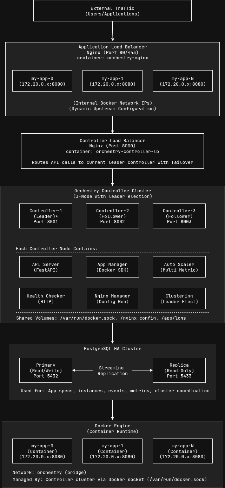

# Architecture Overview

Understanding Orchestry's system design, components, and architectural decisions.

## System Architecture

Orchestry follows a microservices architecture with clear separation of concerns. The system is designed to be scalable, resilient, and easy to maintain.



## Core Components

### 1. API Server (FastAPI)

**Purpose**: Provides REST API endpoints for external interaction

**Key Responsibilities**:
- Accept API requests for application management
- Validate input specifications
- Coordinate with other components
- Return structured responses
- Handle authentication and authorization (future)

**Technology**: FastAPI with uvicorn ASGI server

**Key Files**:
- `controller/api.py` - Main API endpoints
- `controller/main.py` - Application entry point

### 2. Application Manager

**Purpose**: Manages the lifecycle of containerized applications

**Key Responsibilities**:
- Register applications from specifications
- Create and destroy Docker containers
- Monitor container health and status
- Handle container networking
- Manage application scaling

**Technology**: Docker Python SDK

**Key Files**:
- `controller/manager.py` - Core application management logic
- `app_spec/models.py` - Application specification models

**Key Operations**:
```python
# Register a new application
app_manager.register_app(app_spec)

# Start application with desired replicas
app_manager.start_app(app_name, replicas=3)

# Scale application
app_manager.scale_app(app_name, target_replicas=5)

# Stop application
app_manager.stop_app(app_name)
```

### 3. Auto Scaler

**Purpose**: Makes intelligent scaling decisions based on metrics

**Key Responsibilities**:
- Collect application metrics (CPU, memory, RPS, latency)
- Analyze metrics against scaling policies
- Make scale-out/scale-in decisions
- Implement cooldown periods
- Track scaling history and decisions

**Technology**: Custom scaling algorithm with pluggable metrics

**Key Files**:
- `controller/scaler.py` - Auto-scaling logic and policies

**Scaling Algorithm**:
```python
def should_scale(metrics, policy):
    # Multi-metric scaling decision
    scale_factors = {
        'cpu': metrics.cpu_percent / policy.max_cpu_percent,
        'memory': metrics.memory_percent / policy.max_memory_percent,
        'rps': metrics.rps / (policy.target_rps_per_replica * metrics.replicas),
        'latency': metrics.p95_latency / policy.max_latency_ms,
        'connections': metrics.connections / (policy.max_conn_per_replica * metrics.replicas)
    }
    
    # Scale out if any metric exceeds threshold
    max_factor = max(scale_factors.values())
    if max_factor > policy.scale_out_threshold_pct / 100:
        return ScaleDecision(should_scale=True, direction='out')
        
    # Scale in if all metrics below threshold
    if max_factor < policy.scale_in_threshold_pct / 100:
        return ScaleDecision(should_scale=True, direction='in')
        
    return ScaleDecision(should_scale=False)
```

### 4. Health Checker

**Purpose**: Monitors application health and availability

**Key Responsibilities**:
- Perform periodic health checks on containers
- Support HTTP and TCP health checks
- Track health status and failure counts
- Trigger container replacement on failures
- Update load balancer configuration

**Technology**: Async HTTP client (aiohttp) and TCP sockets

**Key Files**:
- `controller/health.py` - Health checking logic

**Health Check Types**:
- **HTTP**: GET/POST requests to health endpoints
- **TCP**: Socket connections to specified ports
- **Custom**: Application-specific health logic

### 5. Distributed Controller (Leader Election)

**Purpose**: Eliminates single point of failure through distributed controller architecture

**Key Responsibilities**:
- Coordinate leadership election among multiple controller nodes
- Ensure only one active leader manages applications at a time
- Handle automatic failover when leader becomes unavailable
- Maintain cluster membership and health monitoring
- Provide seamless leadership handoff

**Technology**: PostgreSQL-based leader election with lease system

**Key Files**:
- `controller/cluster.py` - Distributed controller and leader election logic
- `controller/api.py` - Leader-aware API decorators and routing

**Key Features**:
- **3-Node Cluster**: Production-ready high availability setup
- **Automatic Failover**: 15-30 second failover on leader failure
- **Split-Brain Prevention**: Database-based coordination prevents conflicts
- **Load Balancer Integration**: Nginx routes write operations to leader only
- **Health Monitoring**: Continuous node health and lease management

**Leader Election Process**:
```python
# Nodes compete for leadership using atomic database operations
def _try_acquire_leadership(self) -> bool:
    # Atomic lease acquisition using PostgreSQL
    cursor.execute("""
        INSERT INTO leader_lease (leader_id, term, expires_at)
        VALUES (%s, %s, CURRENT_TIMESTAMP + INTERVAL '%s seconds')
        ON CONFLICT (id) DO UPDATE SET ...
        WHERE leader_lease.expires_at <= CURRENT_TIMESTAMP
    """)
    return cursor.rowcount > 0
```

**API Integration**:
```python
@leader_required
async def register_app(app_spec: AppSpec):
    # Only leader can execute write operations
    return await app_manager.register_app(app_spec.dict())
```

See [Leader Election Guide](leader-election.md) for detailed implementation.

### 6. Nginx Manager

**Purpose**: Manages dynamic load balancer configuration

**Key Responsibilities**:
- Generate Nginx upstream configurations
- Update configurations when containers change
- Reload Nginx without downtime
- Handle SSL/TLS termination
- Route traffic based on application specifications

**Technology**: Nginx with dynamic configuration generation

**Key Files**:
- `controller/nginx.py` - Nginx configuration management
- `configs/nginx/` - Nginx templates and configurations

**Configuration Generation**:
```python
def generate_upstream_config(app_name, instances):
    config = f"""
upstream {app_name} {{
    {upstream_method};
    keepalive 32;
    
"""
    for instance in healthy_instances:
        config += f"    server {instance.ip}:{instance.port};\n"
    
    config += "}\n"
    return config
```

### 6. State Manager

**Purpose**: Provides persistent state storage and management

**Key Responsibilities**:
- Store application specifications and status
- Track container instances and health
- Maintain scaling policies and history
- Provide event audit trail
- Handle database connections and transactions

**Technology**: PostgreSQL with connection pooling

**Key Files**:
- `state/db.py` - Database abstraction layer

**Data Models**:
- **Applications**: Specifications, status, scaling policies
- **Instances**: Container details, health status, metrics
- **Events**: System events, scaling decisions, errors
- **Metrics**: Historical performance data

### 7. Metrics Collector

**Purpose**: Collects and aggregates application metrics

**Key Responsibilities**:
- Gather container resource metrics
- Collect application-specific metrics
- Calculate derived metrics (RPS, latency percentiles)
- Store time-series data
- Expose metrics for monitoring systems

**Technology**: Docker stats API, Prometheus exposition

**Key Files**:
- `metrics/exporter.py` - Metrics collection and export

## Data Flow

### Application Deployment Flow

```
1. User submits app spec → API Server
2. API Server validates spec → App Manager
3. App Manager stores spec → State Manager → Database
4. App Manager creates containers → Docker Engine
5. Health Checker starts monitoring → Containers
6. Nginx Manager updates config → Load Balancer
7. Auto Scaler starts monitoring → Metrics Collector
```

### Scaling Decision Flow

```
1. Metrics Collector gathers data → Containers
2. Auto Scaler analyzes metrics → Scaling Policy
3. Scaling decision made → App Manager
4. App Manager adjusts containers → Docker Engine
5. Health Checker updates status → Nginx Manager
6. Nginx Manager reloads config → Load Balancer
7. Event logged → State Manager → Database
```

### Request Handling Flow

```
1. External request → Nginx Load Balancer
2. Nginx routes to healthy container → Application Container
3. Container processes request → Response
4. Metrics collected → Metrics Collector
5. Health status updated → Health Checker
```

## Design Principles

### 1. Separation of Concerns

Each component has a single, well-defined responsibility:
- **API Server**: External interface
- **App Manager**: Container lifecycle
- **Auto Scaler**: Scaling decisions
- **Health Checker**: Health monitoring
- **Nginx Manager**: Load balancing
- **State Manager**: Data persistence

### 2. Asynchronous Processing

Critical operations are handled asynchronously:
- Health checks run in parallel
- Scaling operations don't block API requests
- Metrics collection is continuous
- Configuration updates are non-blocking

### 3. Event-Driven Architecture

Components communicate through events:
- Health status changes trigger config updates
- Scaling events are logged for audit
- Container state changes update load balancer
- Metrics trigger scaling decisions

### 4. Resilience and Recovery

The system is designed to handle failures gracefully:
- Database connection pooling and retries
- Container health monitoring and replacement
- Nginx configuration validation before reload
- Graceful degradation during component failures

### 5. Horizontal Scalability

Orchestry itself can run in cluster mode:
- Multiple controller instances
- Leader election for coordination
- Distributed state management
- Load balancing across controllers

## Database Schema

### Core Tables

```sql
-- Applications table
CREATE TABLE applications (
    name VARCHAR(253) PRIMARY KEY,
    spec JSONB NOT NULL,
    status VARCHAR(50) NOT NULL,
    created_at TIMESTAMP WITH TIME ZONE DEFAULT NOW(),
    updated_at TIMESTAMP WITH TIME ZONE DEFAULT NOW(),
    replicas INTEGER DEFAULT 0,
    last_scaled_at TIMESTAMP WITH TIME ZONE,
    mode VARCHAR(20) DEFAULT 'auto'
);

-- Container instances
CREATE TABLE instances (
    id SERIAL PRIMARY KEY,
    app_name VARCHAR(253) NOT NULL REFERENCES applications(name),
    container_id VARCHAR(128) UNIQUE NOT NULL,
    ip INET NOT NULL,
    port INTEGER NOT NULL,
    status VARCHAR(50) NOT NULL,
    created_at TIMESTAMP WITH TIME ZONE DEFAULT NOW(),
    updated_at TIMESTAMP WITH TIME ZONE DEFAULT NOW(),
    failure_count INTEGER DEFAULT 0,
    last_health_check TIMESTAMP WITH TIME ZONE
);

-- System events
CREATE TABLE events (
    id SERIAL PRIMARY KEY,
    app_name VARCHAR(253) REFERENCES applications(name),
    event_type VARCHAR(50) NOT NULL,
    message TEXT NOT NULL,
    timestamp TIMESTAMP WITH TIME ZONE DEFAULT NOW(),
    details JSONB
);

-- Metrics (time-series data)
CREATE TABLE metrics (
    id SERIAL PRIMARY KEY,
    app_name VARCHAR(253) NOT NULL REFERENCES applications(name),
    timestamp TIMESTAMP WITH TIME ZONE DEFAULT NOW(),
    cpu_percent REAL,
    memory_percent REAL,
    rps REAL,
    latency_p95_ms REAL,
    active_connections INTEGER,
    replicas INTEGER
);
```

### Indexes for Performance

```sql
-- Query optimization indexes
CREATE INDEX idx_instances_app_name ON instances(app_name);
CREATE INDEX idx_instances_status ON instances(status);
CREATE INDEX idx_events_app_name_timestamp ON events(app_name, timestamp DESC);
CREATE INDEX idx_events_type_timestamp ON events(event_type, timestamp DESC);
CREATE INDEX idx_metrics_app_timestamp ON metrics(app_name, timestamp DESC);
```

## Configuration Architecture

### Hierarchical Configuration

Configuration is loaded in priority order:

1. **Default values** (hardcoded)
2. **Configuration files** (`config.yaml`)
3. **Environment variables** (`.env`, system env)
4. **Runtime parameters** (API calls)

### Configuration Sources

```python
class ConfigManager:
    def load_config(self):
        config = {}
        
        # 1. Load defaults
        config.update(DEFAULT_CONFIG)
        
        # 2. Load from files
        if os.path.exists('config.yaml'):
            config.update(load_yaml('config.yaml'))
            
        # 3. Load from environment
        config.update(load_env_config())
        
        # 4. Validate and return
        return validate_config(config)
```

## Error Handling Strategy

### Error Categories

1. **Validation Errors**: Invalid input specifications
2. **Resource Errors**: Insufficient system resources
3. **Infrastructure Errors**: Docker daemon, database issues
4. **Application Errors**: Container startup failures
5. **Network Errors**: Load balancer configuration issues

### Error Recovery

```python
class ErrorHandler:
    async def handle_container_failure(self, container_id, error):
        # 1. Log the error
        await self.log_event('container_failure', container_id, error)
        
        # 2. Attempt recovery
        if self.should_restart(error):
            await self.restart_container(container_id)
        else:
            await self.replace_container(container_id)
            
        # 3. Update load balancer
        await self.update_nginx_config()
```

## Security Architecture

### Network Security

- **Container Isolation**: Dedicated Docker network
- **Traffic Encryption**: TLS termination at load balancer
- **Internal Communication**: Encrypted inter-service communication
- **Firewall Rules**: Restrict network access

### Access Control

- **API Authentication**: JWT-based authentication (future)
- **Role-Based Access**: RBAC for different user types (future)
- **Audit Logging**: Complete audit trail of all operations

### Container Security

- **Image Scanning**: Vulnerability scanning of container images
- **Runtime Security**: Container runtime protection
- **Resource Limits**: CPU and memory constraints
- **Non-Root Execution**: Containers run as non-root users

## Monitoring Architecture

### Metrics Collection

```python
class MetricsCollector:
    async def collect_app_metrics(self, app_name):
        instances = await self.get_app_instances(app_name)
        
        metrics = {
            'cpu_percent': await self.get_cpu_usage(instances),
            'memory_percent': await self.get_memory_usage(instances),
            'rps': await self.calculate_rps(app_name),
            'latency_p95': await self.get_latency_percentile(app_name, 95),
            'active_connections': await self.get_connection_count(instances)
        }
        
        await self.store_metrics(app_name, metrics)
        return metrics
```

### Observability Stack

- **Metrics**: Prometheus + Grafana
- **Logs**: Structured JSON logging
- **Tracing**: OpenTelemetry integration (future)
- **Alerting**: AlertManager integration (future)

## Performance Considerations

### Database Performance

- **Connection Pooling**: Efficient database connection management
- **Query Optimization**: Indexed queries and efficient joins
- **Read Replicas**: Separate read/write workloads
- **Archival Strategy**: Historical data management

### Scaling Performance

- **Concurrent Operations**: Parallel scaling operations
- **Batch Processing**: Bulk container operations
- **Caching**: Metrics and configuration caching
- **Async Processing**: Non-blocking operations

### Memory Management

- **Connection Pools**: Bounded connection pools
- **Metrics Retention**: Time-based data cleanup
- **Container Limits**: Per-container resource limits
- **Garbage Collection**: Periodic cleanup tasks

---

**Next Steps**: Explore [Core Components](components.md) for detailed implementation details.
