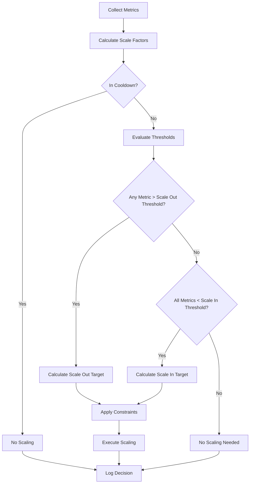

# Scaling Algorithm

Deep dive into AutoServe's multi-metric auto-scaling algorithm, policies, and decision-making process.

## Overview

AutoServe uses a sophisticated multi-metric scaling algorithm that considers CPU utilization, memory usage, request rate, response latency, and active connections to make intelligent scaling decisions. The algorithm is designed to be predictive, stable, and configurable.

## Core Algorithm

### Scaling Decision Flow



### Scale Factor Calculation

Each metric is normalized to a scale factor representing resource pressure:

```python
def calculate_scale_factors(self, metrics: ScalingMetrics, policy: ScalingPolicy) -> Dict[str, float]:
    """
    Calculate normalized scale factors for each metric.
    A factor of 1.0 means the metric is at its target.
    A factor > 1.0 indicates pressure (potential scale out).
    A factor < 1.0 indicates underutilization (potential scale in).
    """
    factors = {}
    
    # CPU Utilization Factor
    # Target: policy.max_cpu_percent (default: 70%)
    if policy.max_cpu_percent > 0:
        factors['cpu'] = metrics.cpu_percent / policy.max_cpu_percent
    
    # Memory Utilization Factor  
    # Target: policy.max_memory_percent (default: 75%)
    if policy.max_memory_percent > 0:
        factors['memory'] = metrics.memory_percent / policy.max_memory_percent
    
    # Requests Per Second Factor
    # Target: policy.target_rps_per_replica RPS per healthy replica
    if policy.target_rps_per_replica > 0 and metrics.healthy_replicas > 0:
        current_rps_per_replica = metrics.rps / metrics.healthy_replicas
        factors['rps'] = current_rps_per_replica / policy.target_rps_per_replica
    
    # Response Latency Factor
    # Target: policy.max_p95_latency_ms (default: 250ms)
    if policy.max_p95_latency_ms > 0:
        factors['latency'] = metrics.p95_latency_ms / policy.max_p95_latency_ms
    
    # Connection Count Factor
    # Target: policy.max_conn_per_replica connections per healthy replica
    if policy.max_conn_per_replica > 0 and metrics.healthy_replicas > 0:
        current_conn_per_replica = metrics.active_connections / metrics.healthy_replicas
        factors['connections'] = current_conn_per_replica / policy.max_conn_per_replica
    
    return factors
```

## Scaling Policies

### Policy Structure

```python
@dataclass
class ScalingPolicy:
    """Comprehensive scaling policy configuration."""
    
    # Replica bounds
    min_replicas: int = 1
    max_replicas: int = 5
    
    # Performance targets
    target_rps_per_replica: int = 50        # Target requests/sec per replica
    max_p95_latency_ms: int = 250          # Maximum 95th percentile latency
    max_conn_per_replica: int = 80         # Maximum connections per replica
    max_cpu_percent: float = 70.0          # Maximum CPU utilization %
    max_memory_percent: float = 75.0       # Maximum memory utilization %
    
    # Scaling thresholds
    scale_out_threshold_pct: int = 80      # Scale out when factor > 80% of target
    scale_in_threshold_pct: int = 30       # Scale in when factor < 30% of target
    
    # Timing configuration
    window_seconds: int = 60               # Metrics evaluation window
    cooldown_seconds: int = 180            # Minimum time between scaling events
    
    # Advanced settings
    max_scale_out_step: int = 0            # Max replicas to add (0 = unlimited)
    max_scale_in_step: int = 1             # Max replicas to remove per operation
    stabilization_window_seconds: int = 300 # Time to wait for stability
    
    # Metric weights (future enhancement)
    cpu_weight: float = 1.0
    memory_weight: float = 1.0
    rps_weight: float = 1.0
    latency_weight: float = 1.5            # Latency gets higher priority
    connection_weight: float = 0.8
```

### Policy Examples

#### Latency-Sensitive Application

```python
latency_sensitive_policy = ScalingPolicy(
    min_replicas=3,                        # Always maintain 3 replicas
    max_replicas=20,                       # Can scale up to 20
    target_rps_per_replica=30,             # Lower RPS target
    max_p95_latency_ms=100,                # Strict 100ms latency limit
    max_cpu_percent=60.0,                  # Conservative CPU target
    scale_out_threshold_pct=70,            # Scale out early
    scale_in_threshold_pct=20,             # Scale in conservatively
    cooldown_seconds=120,                  # Faster scaling decisions
    stabilization_window_seconds=180       # Shorter stability window
)
```

#### Batch Processing Application

```python
batch_processing_policy = ScalingPolicy(
    min_replicas=1,                        # Can scale to zero
    max_replicas=50,                       # High maximum for bursts
    target_rps_per_replica=200,            # Higher RPS tolerance
    max_p95_latency_ms=2000,               # More latency tolerance
    max_cpu_percent=90.0,                  # High CPU utilization OK
    max_memory_percent=85.0,               # High memory utilization OK
    scale_out_threshold_pct=85,            # Scale out later
    scale_in_threshold_pct=15,             # Scale in aggressively
    cooldown_seconds=300,                  # Slower scaling decisions
    max_scale_out_step=5                   # Scale out in larger steps
)
```

#### Development Environment

```python
dev_policy = ScalingPolicy(
    min_replicas=1,
    max_replicas=3,                        # Limited scaling for dev
    target_rps_per_replica=10,             # Low traffic expected
    max_p95_latency_ms=1000,               # Relaxed latency
    max_cpu_percent=80.0,
    scale_out_threshold_pct=90,            # Scale out very late
    scale_in_threshold_pct=10,             # Scale in very early
    cooldown_seconds=600,                  # Long cooldown for stability
    stabilization_window_seconds=600
)
```

## Scaling Decision Logic

### Scale Out Decision

```python
def should_scale_out(self, scale_factors: Dict[str, float], policy: ScalingPolicy) -> Tuple[bool, str, List[str]]:
    """
    Determine if scale out is needed.
    
    Scale out if ANY metric exceeds the scale out threshold.
    This ensures responsive scaling when any resource becomes constrained.
    """
    threshold = policy.scale_out_threshold_pct / 100.0
    triggered_metrics = []
    
    for metric_name, factor in scale_factors.items():
        if factor > threshold:
            triggered_metrics.append(metric_name)
    
    if triggered_metrics:
        # Find the most constrained metric
        max_metric = max(scale_factors.items(), key=lambda x: x[1])
        reason = f"Scale out triggered by {max_metric[0]}: {max_metric[1]:.2f}x target"
        return True, reason, triggered_metrics
    
    return False, "All metrics below scale out threshold", []
```

### Scale In Decision

```python
def should_scale_in(self, scale_factors: Dict[str, float], policy: ScalingPolicy, current_replicas: int) -> Tuple[bool, str]:
    """
    Determine if scale in is needed.
    
    Scale in only if ALL metrics are below the scale in threshold.
    This ensures we don't scale in prematurely while any resource is under pressure.
    """
    if current_replicas <= policy.min_replicas:
        return False, f"Already at minimum replicas ({policy.min_replicas})"
    
    threshold = policy.scale_in_threshold_pct / 100.0
    
    for metric_name, factor in scale_factors.items():
        if factor > threshold:
            return False, f"Cannot scale in: {metric_name} factor {factor:.2f} > threshold {threshold:.2f}"
    
    # All metrics are below threshold
    max_factor = max(scale_factors.values()) if scale_factors else 0
    reason = f"Scale in: All metrics below threshold (max factor: {max_factor:.2f})"
    return True, reason
```

## Target Replica Calculation

### Scale Out Target

```python
def calculate_scale_out_target(self, current_replicas: int, scale_factors: Dict[str, float], 
                              policy: ScalingPolicy) -> int:
    """
    Calculate target replicas for scale out operation.
    
    Uses the highest scale factor to determine how many replicas are needed
    to bring all metrics back within acceptable ranges.
    """
    if not scale_factors:
        return current_replicas + 1
    
    # Find the metric with highest pressure
    max_factor = max(scale_factors.values())
    
    # Calculate theoretical target based on max factor
    # If factor is 1.5, we need 50% more capacity
    theoretical_target = math.ceil(current_replicas * max_factor)
    
    # Apply step limits
    if policy.max_scale_out_step > 0:
        max_increase = policy.max_scale_out_step
        theoretical_target = min(theoretical_target, current_replicas + max_increase)
    
    # Conservative scaling: don't increase by more than 100% at once
    max_conservative = current_replicas * 2
    theoretical_target = min(theoretical_target, max_conservative)
    
    # Apply absolute maximum
    final_target = min(theoretical_target, policy.max_replicas)
    
    # Ensure we're actually scaling out
    return max(final_target, current_replicas + 1)
```

### Scale In Target

```python
def calculate_scale_in_target(self, current_replicas: int, scale_factors: Dict[str, float], 
                             policy: ScalingPolicy) -> int:
    """
    Calculate target replicas for scale in operation.
    
    Uses conservative approach - remove one replica at a time unless
    utilization is extremely low.
    """
    if current_replicas <= policy.min_replicas:
        return current_replicas
    
    # Default: scale in by 1 replica
    target = current_replicas - 1
    
    # If utilization is very low, consider scaling in more aggressively
    if scale_factors:
        max_factor = max(scale_factors.values())
        if max_factor < 0.1:  # Less than 10% utilization
            # Can scale in more aggressively
            theoretical_target = math.floor(current_replicas * max_factor * 2)  # 2x buffer
            target = max(theoretical_target, policy.min_replicas)
    
    # Apply step limits
    if policy.max_scale_in_step > 0:
        max_decrease = policy.max_scale_in_step
        target = max(target, current_replicas - max_decrease)
    
    # Ensure we don't go below minimum
    return max(target, policy.min_replicas)
```

## Cooldown and Stability

### Cooldown Management

```python
def is_in_cooldown(self, app_name: str, cooldown_seconds: int) -> bool:
    """
    Check if application is in cooldown period.
    
    Cooldown prevents rapid scaling oscillations by enforcing
    minimum time between scaling operations.
    """
    last_scale_time = self.last_scale_time.get(app_name, 0)
    return time.time() - last_scale_time < cooldown_seconds

def update_cooldown_timer(self, app_name: str):
    """Update the last scaling time for cooldown calculation."""
    self.last_scale_time[app_name] = time.time()
```

### Stability Window

```python
def is_system_stable(self, app_name: str, policy: ScalingPolicy) -> bool:
    """
    Check if the system has been stable for the required period.
    
    Stability window ensures the system has had time to adapt to
    previous scaling decisions before making new ones.
    """
    # Get recent scaling events
    recent_events = self.get_recent_scaling_events(
        app_name, 
        since=time.time() - policy.stabilization_window_seconds
    )
    
    # System is stable if no scaling events in the stability window
    return len(recent_events) == 0
```

## Metrics Collection and Analysis

### Metrics Aggregation

```python
def aggregate_metrics(self, app_name: str, window_seconds: int) -> ScalingMetrics:
    """
    Aggregate metrics over the specified time window.
    
    Uses different aggregation methods for different metrics:
    - CPU/Memory: Average over window
    - RPS: Rate calculation over window  
    - Latency: 95th percentile over window
    - Connections: Current value (latest)
    """
    cutoff_time = time.time() - window_seconds
    history = self.metrics_history[app_name]
    
    # Filter metrics within window
    cpu_points = [p for p in history['cpu'] if p.timestamp >= cutoff_time]
    memory_points = [p for p in history['memory'] if p.timestamp >= cutoff_time]
    rps_points = [p for p in history['rps'] if p.timestamp >= cutoff_time]
    latency_points = [p for p in history['latency'] if p.timestamp >= cutoff_time]
    connection_points = [p for p in history['connections'] if p.timestamp >= cutoff_time]
    replica_points = [p for p in history['healthy_replicas'] if p.timestamp >= cutoff_time]
    
    # Calculate aggregated values
    metrics = ScalingMetrics()
    
    if cpu_points:
        metrics.cpu_percent = statistics.mean([p.value for p in cpu_points])
    
    if memory_points:
        metrics.memory_percent = statistics.mean([p.value for p in memory_points])
    
    if rps_points and len(rps_points) >= 2:
        # Calculate rate from first and last points
        first_point = rps_points[0]
        last_point = rps_points[-1]
        time_diff = last_point.timestamp - first_point.timestamp
        if time_diff > 0:
            metrics.rps = (last_point.value - first_point.value) / time_diff
    
    if latency_points:
        # Use 95th percentile
        latencies = sorted([p.value for p in latency_points])
        percentile_idx = int(0.95 * len(latencies))
        metrics.p95_latency_ms = latencies[percentile_idx]
    
    if connection_points:
        # Use latest value
        metrics.active_connections = connection_points[-1].value
    
    if replica_points:
        # Use latest healthy replica count
        metrics.healthy_replicas = int(replica_points[-1].value)
        metrics.total_replicas = self.get_total_replicas(app_name)
    
    return metrics
```

### Smoothing and Filtering

```python
def apply_smoothing(self, current_metrics: ScalingMetrics, 
                   previous_metrics: ScalingMetrics, alpha: float = 0.3) -> ScalingMetrics:
    """
    Apply exponential smoothing to reduce noise in metrics.
    
    Uses exponential weighted moving average:
    smoothed_value = alpha * current + (1 - alpha) * previous
    """
    if not previous_metrics:
        return current_metrics
    
    smoothed = ScalingMetrics()
    smoothed.cpu_percent = alpha * current_metrics.cpu_percent + (1 - alpha) * previous_metrics.cpu_percent
    smoothed.memory_percent = alpha * current_metrics.memory_percent + (1 - alpha) * previous_metrics.memory_percent
    smoothed.rps = alpha * current_metrics.rps + (1 - alpha) * previous_metrics.rps
    smoothed.p95_latency_ms = alpha * current_metrics.p95_latency_ms + (1 - alpha) * previous_metrics.p95_latency_ms
    smoothed.active_connections = current_metrics.active_connections  # Don't smooth discrete values
    smoothed.healthy_replicas = current_metrics.healthy_replicas
    smoothed.total_replicas = current_metrics.total_replicas
    
    return smoothed
```

## Advanced Features

### Predictive Scaling

```python
def predict_future_load(self, app_name: str, lookahead_minutes: int = 5) -> ScalingMetrics:
    """
    Predict future load based on historical trends.
    
    Uses linear regression on recent metrics to predict future values.
    This enables proactive scaling before resources become constrained.
    """
    history = self.metrics_history[app_name]
    current_time = time.time()
    lookback_seconds = lookahead_minutes * 60 * 4  # Look back 4x the prediction window
    
    # Get recent RPS data points
    rps_points = [p for p in history['rps'] 
                  if p.timestamp >= current_time - lookback_seconds]
    
    if len(rps_points) < 10:  # Need sufficient data
        return self.get_current_metrics(app_name)
    
    # Simple linear trend calculation
    x_values = [p.timestamp - current_time for p in rps_points]
    y_values = [p.value for p in rps_points]
    
    # Calculate trend (slope)
    n = len(x_values)
    sum_x = sum(x_values)
    sum_y = sum(y_values)
    sum_xy = sum(x * y for x, y in zip(x_values, y_values))
    sum_x2 = sum(x * x for x in x_values)
    
    slope = (n * sum_xy - sum_x * sum_y) / (n * sum_x2 - sum_x * sum_x)
    intercept = (sum_y - slope * sum_x) / n
    
    # Predict future RPS
    future_time = lookahead_minutes * 60
    predicted_rps = slope * future_time + intercept
    
    # Create predicted metrics
    current_metrics = self.get_current_metrics(app_name)
    predicted_metrics = ScalingMetrics(
        rps=max(predicted_rps, 0),  # RPS can't be negative
        cpu_percent=current_metrics.cpu_percent,
        memory_percent=current_metrics.memory_percent,
        p95_latency_ms=current_metrics.p95_latency_ms,
        active_connections=current_metrics.active_connections,
        healthy_replicas=current_metrics.healthy_replicas,
        total_replicas=current_metrics.total_replicas
    )
    
    return predicted_metrics
```

### Custom Scaling Strategies

```python
class ScalingStrategy:
    """Base class for custom scaling strategies."""
    
    def should_scale(self, metrics: ScalingMetrics, policy: ScalingPolicy) -> ScalingDecision:
        raise NotImplementedError

class ConservativeStrategy(ScalingStrategy):
    """Conservative scaling strategy - prefers stability over responsiveness."""
    
    def should_scale(self, metrics: ScalingMetrics, policy: ScalingPolicy) -> ScalingDecision:
        # Require multiple metrics to be over threshold
        scale_factors = calculate_scale_factors(metrics, policy)
        over_threshold = sum(1 for f in scale_factors.values() 
                           if f > policy.scale_out_threshold_pct / 100)
        
        if over_threshold >= 2:  # Require at least 2 metrics
            return ScalingDecision(should_scale=True, direction='out')
        
        # Scale in only if all metrics very low
        if all(f < policy.scale_in_threshold_pct / 200 for f in scale_factors.values()):
            return ScalingDecision(should_scale=True, direction='in')
        
        return ScalingDecision(should_scale=False)

class AggressiveStrategy(ScalingStrategy):
    """Aggressive scaling strategy - prioritizes performance over cost."""
    
    def should_scale(self, metrics: ScalingMetrics, policy: ScalingPolicy) -> ScalingDecision:
        scale_factors = calculate_scale_factors(metrics, policy)
        
        # Scale out if any metric approaching threshold
        if any(f > policy.scale_out_threshold_pct / 150 for f in scale_factors.values()):
            return ScalingDecision(should_scale=True, direction='out')
        
        # Scale in only if all metrics very low for extended period
        if (all(f < policy.scale_in_threshold_pct / 100 for f in scale_factors.values()) and
            self.low_utilization_duration(app_name) > 600):  # 10 minutes
            return ScalingDecision(should_scale=True, direction='in')
        
        return ScalingDecision(should_scale=False)
```

## Performance Optimization

### Efficient Metrics Storage

```python
class RingBuffer:
    """Memory-efficient ring buffer for metrics storage."""
    
    def __init__(self, max_size: int = 1000):
        self.max_size = max_size
        self.buffer = [None] * max_size
        self.head = 0
        self.size = 0
    
    def append(self, item):
        self.buffer[self.head] = item
        self.head = (self.head + 1) % self.max_size
        if self.size < self.max_size:
            self.size += 1
    
    def get_recent(self, count: int):
        if count >= self.size:
            # Return all items
            if self.size < self.max_size:
                return [item for item in self.buffer[:self.size] if item is not None]
            else:
                return (self.buffer[self.head:] + self.buffer[:self.head])
        else:
            # Return most recent items
            items = []
            pos = (self.head - 1) % self.max_size
            for _ in range(count):
                if self.buffer[pos] is not None:
                    items.append(self.buffer[pos])
                pos = (pos - 1) % self.max_size
            return list(reversed(items))
```

### Batch Scaling Operations

```python
async def batch_scale_operations(self, scaling_decisions: List[Tuple[str, int]]):
    """
    Execute multiple scaling operations in parallel.
    
    Improves performance when scaling multiple applications simultaneously.
    """
    tasks = []
    for app_name, target_replicas in scaling_decisions:
        task = asyncio.create_task(self.execute_scaling(app_name, target_replicas))
        tasks.append(task)
    
    # Execute all scaling operations concurrently
    results = await asyncio.gather(*tasks, return_exceptions=True)
    
    # Handle results and exceptions
    for i, result in enumerate(results):
        app_name, target_replicas = scaling_decisions[i]
        if isinstance(result, Exception):
            logger.error(f"Scaling failed for {app_name}: {result}")
        else:
            logger.info(f"Successfully scaled {app_name} to {target_replicas} replicas")
```

## Monitoring and Debugging

### Scaling Decision Logging

```python
def log_scaling_decision(self, app_name: str, decision: ScalingDecision):
    """Log detailed scaling decision for debugging and analysis."""
    log_data = {
        'app_name': app_name,
        'timestamp': time.time(),
        'should_scale': decision.should_scale,
        'current_replicas': decision.current_replicas,
        'target_replicas': decision.target_replicas,
        'reason': decision.reason,
        'triggered_by': decision.triggered_by,
        'metrics': {
            'cpu_percent': decision.metrics.cpu_percent,
            'memory_percent': decision.metrics.memory_percent,
            'rps': decision.metrics.rps,
            'latency_p95_ms': decision.metrics.p95_latency_ms,
            'active_connections': decision.metrics.active_connections
        } if decision.metrics else None,
        'scale_factors': self.last_scale_factors.get(app_name, {})
    }
    
    # Store in database for analysis
    asyncio.create_task(
        self.state_store.log_event(
            app_name=app_name,
            event_type='scaling_decision',
            message=decision.reason,
            details=log_data
        )
    )
```

### Performance Metrics

```python
def get_scaling_performance_metrics(self, app_name: str) -> dict:
    """Get performance metrics for the scaling algorithm."""
    decisions = self.get_recent_scaling_decisions(app_name, hours=24)
    
    total_decisions = len(decisions)
    scale_out_decisions = len([d for d in decisions if d.target_replicas > d.current_replicas])
    scale_in_decisions = len([d for d in decisions if d.target_replicas < d.current_replicas])
    no_scale_decisions = total_decisions - scale_out_decisions - scale_in_decisions
    
    # Calculate average response time to scaling needs
    response_times = []
    for decision in decisions:
        if decision.should_scale:
            # Time from when scaling was needed to when it was decided
            response_time = self.calculate_response_time(app_name, decision.timestamp)
            if response_time:
                response_times.append(response_time)
    
    return {
        'total_decisions': total_decisions,
        'scale_out_count': scale_out_decisions,
        'scale_in_count': scale_in_decisions,
        'no_scale_count': no_scale_decisions,
        'avg_response_time_seconds': statistics.mean(response_times) if response_times else 0,
        'scaling_efficiency': self.calculate_scaling_efficiency(app_name),
        'oscillation_rate': self.calculate_oscillation_rate(app_name)
    }
```

---

**Next Steps**: Learn about [Health Monitoring](health.md) and how health checks integrate with scaling decisions.